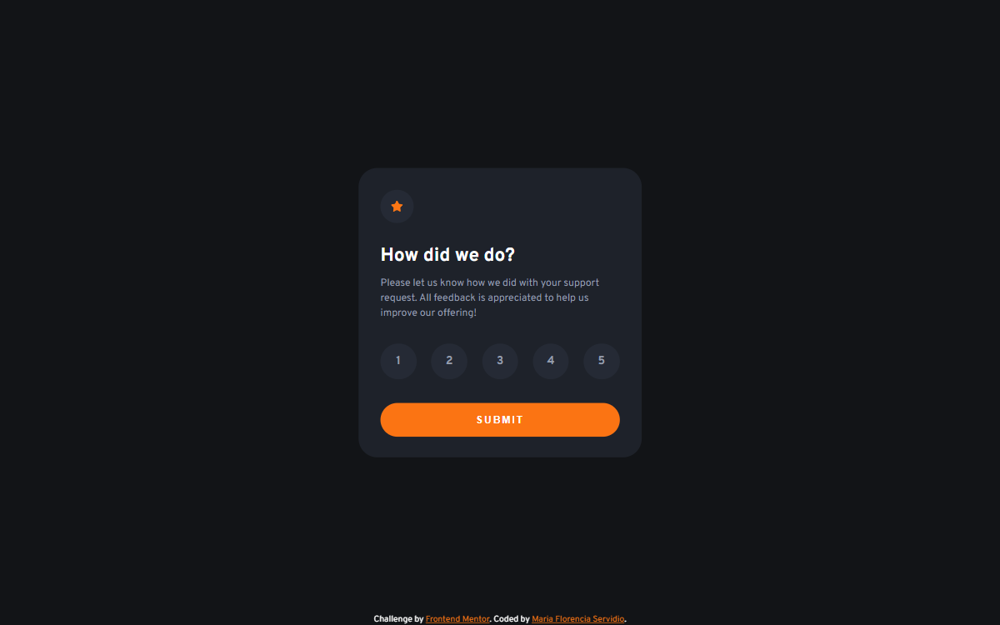

# Frontend Mentor - Interactive rating component solution

This is a solution to the [Interactive rating component challenge on Frontend Mentor](https://www.frontendmentor.io/challenges/interactive-rating-component-koxpeBUmI). Frontend Mentor challenges help you improve your coding skills by building realistic projects. 

## Table of contents

- [Overview](#overview)
  - [The challenge](#the-challenge)
  - [Screenshot](#screenshot)
  - [Links](#links)
- [My process](#my-process)
  - [Built with](#built-with)
  - [What I learned](#what-i-learned)
  - [Continued development](#continued-development)
  - [Useful resources](#useful-resources)
- [Author](#author)
- [Acknowledgments](#acknowledgments)


## Overview

### The challenge

Users should be able to:

- View the optimal layout for the app depending on their device's screen size
- See hover states for all interactive elements on the page
- Select and submit a number rating
- See the "Thank you" card state after submitting a rating

### Screenshot



### Links

- Live Site URL: [Vercel](https://interactive-rating-component-rouge.vercel.app/)

## My process

### Built with

- Semantic HTML5 markup
- CSS custom properties
- Flexbox
- Mobile-first workflow

### What I learned

This challenge helped me to practice how to add a click event listener to a NodeList and replace classes in an element.
The "for" loops through every circle button and adds the click event to the actual element when is clicked and captures its content.
If the class "active" exist, that state is erased.

Some code snippet below:

```js
for (let i=0; i < circleBtn.length; i++){
    circleBtn[i].addEventListener('click', function() {
        var actual = document.getElementsByClassName('active');
        if (actual.length > 0) {
            actual[0].className = actual[0].className.replace(" active no__hover", "");
            value = false;
          }
        this.className += " active" + " no__hover";
        value = true;
        starnum = circleBtn[i].textContent;
    });
};
```

### Continued development

My actual and future plans are to keep on practising and improving my Javascript and CSS skills. I want to build better and optimized websites and web apps, focusing on a mobile-first approach.

### Useful resources

- [W3Schools](https://www.w3schools.com/howto/howto_js_active_element.asp) - This helped me understand how to implement the Javascript code.

## Author

- Behance - [María Florencia Servidio](https://www.behance.net/mflorservidio88)
- Frontend Mentor - [@Maflo88](https://www.frontendmentor.io/profile/Maflo88)


## Acknowledgments

Thanks to W3Schools for their tutorials and examples. :D
And thanks to FrontEnd Mentor for their awesome challenges.
